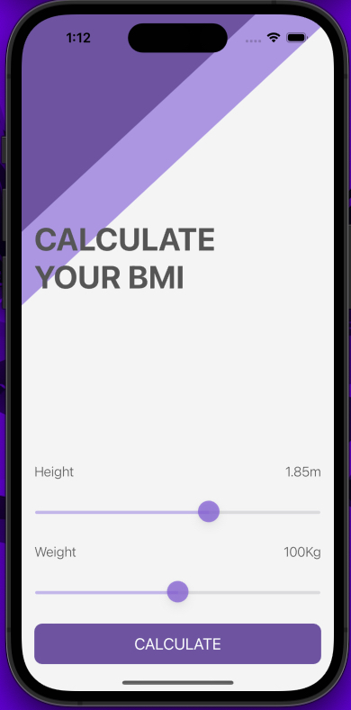
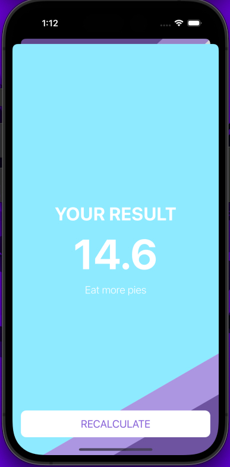
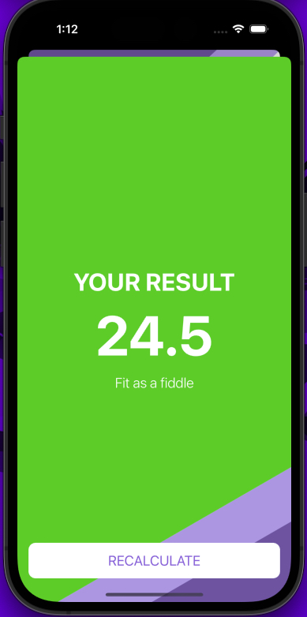
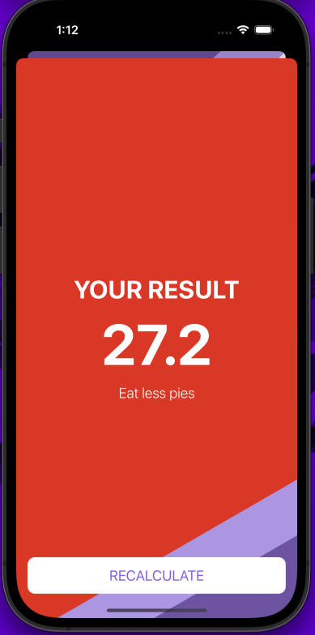
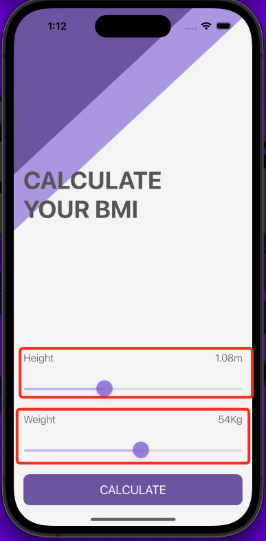
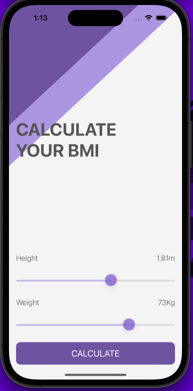
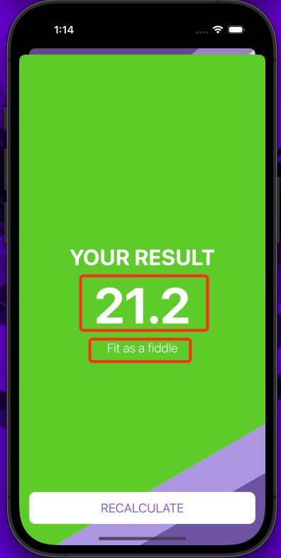

# BMI Calculator iOS App

**Table of Contents**
- [Introduction](#introduction)
- [Motivation](#motivation)
- [Technology Used](#technologyUsed)
- [Build Status](#buildStatus)
- [Features](#features)
- [Installation](#installation)
- [Execution](#execution)

## Introduction 
Mobile Body Mass Index calculator. Based on the user’s weight and height it will calculate their body mass and give a piece of health advice depending on whether if they have eaten too many pies or if they need to eat more pies.

## Motivation 
This is a personal learning project aimed to teach me how to use Optionals, solidify my understanding of MVC design pattern and use classes/struct in Swift.

## Technology Used 
<table>
  <tbody>
    <tr>
      <td>Language</td>
      <td>Swift</td>
    </tr>
    <tr>
      <td>Notable Technology Utilized</td>
      <td>
        <ul>
          <li>Storyboard</li>
          <li>Creating multi-screen and animated navigation</li>
          <li>Slider widget</li>
          <li>Optional binding, optional chaining and nil coalescing operator</li>
          <li>Usage of classes and structs</li>
          <li>Pass values and pass by reference</li>
          <li>Formatting of strings</li>
          <li>Color literals</li>
        </ul>
      </td>
    </tr>
  </tbody>
</table>

## Build Status 
Project is completed.

## Features 
- Adjustable sliders for height and weight
- BMI calculation and advice
- Different BMI messages for different calculations

### Adjustable sliders for height and weight

* User can adjust height and weight inputs by moving the slider
* Height and weight labels will get refreshed in real-time as the user moves the slider

### BMI calculation and advice

* After user presses on "CALCULATE" the app will calculate their BMI score based on actual medical calculations

### Different BMI messages for different calculations

* User will receive different BMI messages for different BMI scores

# Installation 
* Ensure XCode is installed (only available on MacOS)

# Execution 
* Open the "BMI Calculator.xcodeproj" file in XCode
* Once the project is open you can click the play button at the top of the IDE to run the iPhone simulator or use a physical device
